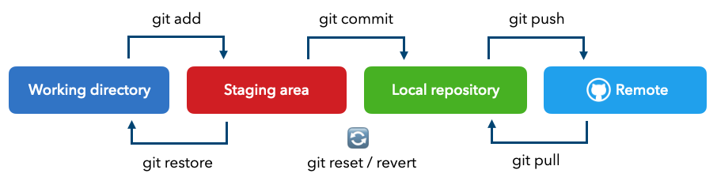

<!-- _class: lead -->

# Git

---

# Git

* What is version control?
* Why use Git? (tracking changes, collaboration, reverting changes, etc.)
* Key concepts: repository, commit, branch, merge.

---

## Installation and Configuration

* Downloading and installing [Git](https://git-scm.com/).
* Configuring the user: `git config --global user.name "Your Name"` and `git config --global user.email "your.email@example.com"`.
* Exercise: Check the configuration with `git config --list`.

---

## Creating a New Git Repository

* Initializing a directory: git init.
* Adding files to the repository: git add ..
* Committing changes: git commit -m "First commit".

Exercise: Create a new directory, add some files, and commit them.

---

## Branches: Working in Parallel

* Creating a branch: `git branch my_branch`.
* Switching between branches: `git checkout my_branch`.
* Merging branches: `git merge my_branch`.

`git checkout -d my_branch`

Exercise: Create a new branch, make changes, and then merge it with the main branch.

---

## The Commit Lifecycle

* Working directory, index, local repository, remote repository.
* Key commands: `add`, `commit`, `push`, `pull`.

---

## Ignoring Files with .gitignore

* Creating the `.gitignore` file.
* Examples of patterns: `.DS_Store`, `node_modules`, etc.

* [gitignore.io](https://www.toptal.com/developers/gitignore/)
* `.gitkeep` file

Exercise: Create a `.gitignore` file to ignore temporary files and compiled files.

---

## Collaborating with Git

* Creating a remote repository.
* Adding a remote repository: `git remote add origin https://....`
* Pushing changes: `git push -u origin main`.
* Pulling changes: `git pull`.
* Cloning repository: `git clone`.

---

## Resolving Merge Conflicts

* Conflicts occur when two branches modify the same file.
* Manually resolving conflicts.
* Using a visualization tool to facilitate resolution.

Exercise: Create a conflict and resolve it.

---

## Reverting Changes with Git

* Discarding changes: `git restore .`.
* Discarding changes: `git restore --staged .`.
* Reverting to a previous commit: `git reset --hard <commit>`.
* `git log`
