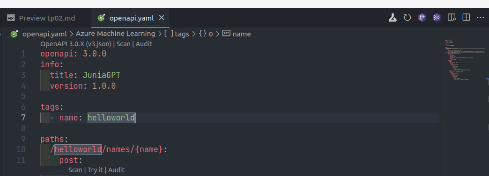
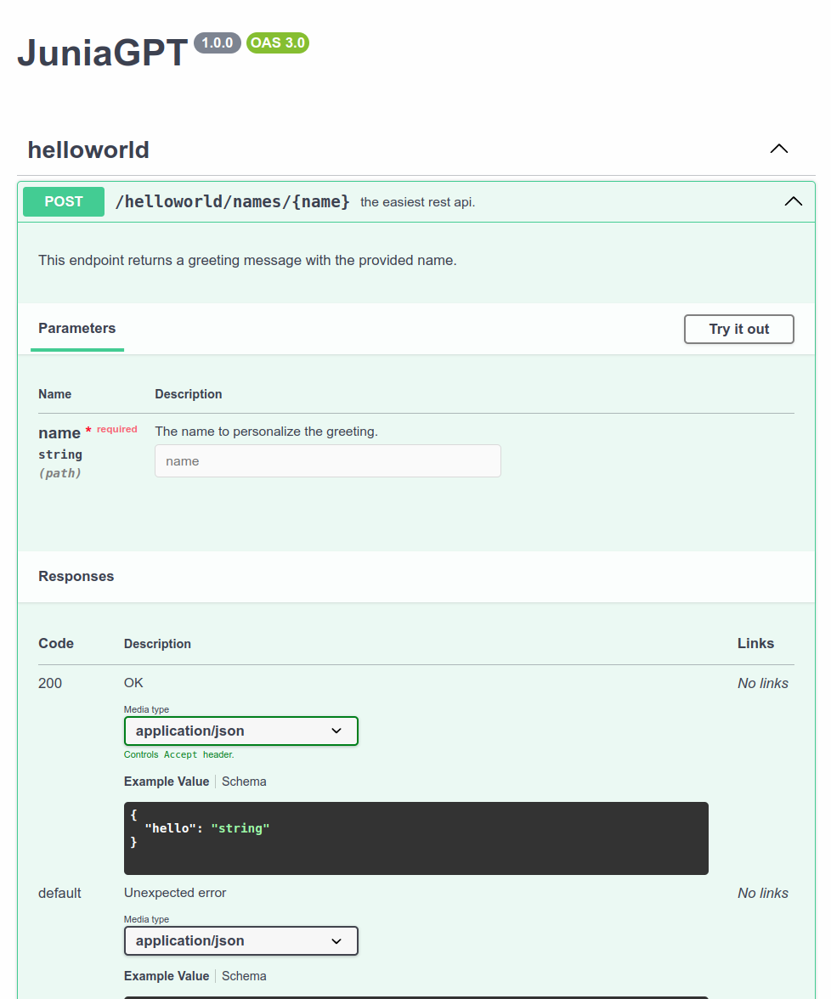

# Worklab 2: Setup of the backend project, connect it to the frontend and setup the repository

- [Worklab 2: Setup of the backend project, connect it to the frontend and setup the repository](#worklab-2-setup-of-the-backend-project-connect-it-to-the-frontend-and-setup-the-repository)
  - [Setup of the REST API Helloworld](#setup-of-the-rest-api-helloworld)
    - [The Helloworld of REST API](#the-helloworld-of-rest-api)
      - [As part of the URL path](#as-part-of-the-url-path)
      - [As a query parameter](#as-a-query-parameter)
    - [Writing the documentation of the API with OpenAPI/Swagger](#writing-the-documentation-of-the-api-with-openapiswagger)
    - [FastAPI and Pydantic](#fastapi-and-pydantic)
      - [Redirection to the documentation](#redirection-to-the-documentation)
      - [Why should we use a REST layer ?](#why-should-we-use-a-rest-layer-)
        - [Rate limiter](#rate-limiter)
        - [Security](#security)
    - [Connect FastAPI and Ollama](#connect-fastapi-and-ollama)
    - [Connect FastAPI and the frontend](#connect-fastapi-and-the-frontend)
  - [Setup the repository](#setup-the-repository)
  - [Setup the github actions](#setup-the-github-actions)
  - [To go further: LiteLLM](#to-go-further-litellm)


## Setup of the REST API Helloworld

We will use [FastAPI](https://fastapi.tiangolo.com/) to build our REST API backend. FastAPI is a modern, high-performance web framework for building APIs with Python 3.7+.

Its key features are:

* **Speed**:
  * **Leverages ASGI** (Asynchronous Server Gateway Interface) for high concurrency and performance.
  * Significantly faster than many other Python frameworks.
* **Developer Experience**:
  * **Type hints**: Utilizes Python's type hints for automatic data validation and clear code documentation.
  * **Asynchronous support**: Enables efficient handling of multiple requests concurrently, improving overall performance and responsiveness.
* Ease of Use:
  * **Concise and intuitive syntax**: Easy to learn and use, even for beginners.
  * Dependency injection: Simplifies code organization and testing.
* **Production Ready**:
  * **Robust and battle-tested**: Designed for production environments with features like dependency injection, data validation, and security considerations.

In essence, FastAPI aims to:

  * **Increase development speed**: By reducing the time spent on writing boilerplate code and debugging.
  * **Improve code quality**: Through type hints and automatic data validation.
  * **Enhance developer experience**: With excellent documentation and a user-friendly interface.

Key Use Cases:

  * **Building RESTful APIs**: For various applications, including web services, microservices, and machine learning models.
  * **Creating backend services**: For web applications, mobile apps, and other client-side applications.

All the REST APIs and backend we deploy in production are developped using FastAPI. It's an excellent choice, the documentation is quite good and community is large, so you won't have trouble to find answers to your questions.

Let's create a new project for our backend.

* `mkdir backend`
* `cd backend`
* `uv init --app --python 3.12`

We will need the 4 following libraries: fastapi, uvicorn, httpx, pydantic. So let's add them to the project.

* `uv add fastapi pydantic httpx uvicorn`.

You already know `pydantic` and `httpx` from the previous worklab, `uvicorn` is a web server implementation for Python. It's uvicorn that allows fastapi to run.

Again, we will also add `ruff` and `isort` as dev dependencies.

* `uv add isort ruff --dev`

Before jumping into the REST API that will communicate with Ollama. Let's build a simple helloworld REST API.

### The Helloworld of REST API

In the backend directory, create a `main.py` file and write the following code in it.

```py
from fastapi import FastAPI, status


app = FastAPI(title="JuniaGPT", version="1.0.0")

@app.post(
    "/helloworld",
    tags=["helloworld"],
    status_code=status.HTTP_200_OK,
)
def post_hellowolrd() -> dict:
    """the easiest rest api."""
    return {"hello": "world"}
```
This is the simplest REST API you can write. It has a single endpoint `/helloworld` which allows you to a `POST` request, and it returns the following dict in json format `{"hello": "world"}`.

`app = FastAPI(title="JuniaGPT", version="1.0.0")` is the main part of the code, this is this part which defines the FastAPI REST API, you can change the title to your liking, the version should follows the [semantic versioning](https://semver.org/) conventions.

The fact that you have defined an endpoint with to a `POST` request is defined by the following decorator

```py
@app.post(
    "/helloworld",
    tags=["helloworld"],
    status_code=status.HTTP_200_OK,
)
```
`@app.post` will define a `POST` request, `@app.get` will define a `GET` request and so on. Inside you have to define the value of the endpoint, here `"/helloworld"`, some tags (optional) which helps grouping requests, and a `status_code` which defines the standard [status code](https://developer.mozilla.org/fr/docs/Web/HTTP/Status) the endpoint should return if there are no errors.

You can see the full list of parameters of the `FastAPI` class [here](https://fastapi.tiangolo.com/reference/fastapi/#fastapi.FastAPI).

To see you app running, you can use one of the two following commands.

* `uv run uvicorn main:app --host 0.0.0.0 --port 8000 --reload` or
* `uvicorn main:app --host 0.0.0.0 --port 8000 --reload` if you have activated your virtual environment (remember why you need to activate it ?)

The following `curl` command will show that your api is up and running (you need to type it in another terminal than the one you used to run your api).

* `curl -X 'POST' 'http://0.0.0.0:8000/helloworld'`

Let's pimp a little bit our endpoint. We now want it to return `{"hello": "world"}` but with an extra parameter, like a name, so we want it to return for example `{"hello": "world by Mathieu"}`. There are two ways to do that: as part of the URL path, or as a query parameter.

#### As part of the URL path

To do that, update your code as the following one.


```py
from fastapi import FastAPI, status


app = FastAPI(title="JuniaGPT", version="1.0.0")

@app.post(
    "/helloworld/names/{name}",
    tags=["helloworld"],
    status_code=status.HTTP_200_OK,
)
def post_helloworld(name:str) -> dict:
    """the easiest rest api."""
    return {"hello": f"world by {name}"}
```

#### As a query parameter

To do that, update your code as the following one.


```py
from fastapi import FastAPI, status


app = FastAPI(title="JuniaGPT", version="1.0.0")

@app.post(
    "/helloworld/",
    tags=["helloworld"],
    status_code=status.HTTP_200_OK,
)
def post_hellowolrd(name:str) -> dict:
    """the easiest rest api."""
    return {"hello": f"world by {name}"}
```

The difference between the two lies in the URL, for the first one you have `"/helloworld/names/{name}"` so the name is part of the URL and to call this endpoint you have to a request like the following one.

* `curl -X 'POST' 'http://0.0.0.0:8000/helloworld/names/Mathieu'`

While in the latter case, this defines a query parameter, so the request will look like the following one.

* `curl -X 'POST' 'http://0.0.0.0:8000/helloworld/?name=Mathieu'`

Query parameters are always identified by the pattern `?key=value` in urls.

Which one is the best ? The best practice for RESTful API design is that **path parameters** are used to **identify a specific resource or resources**, while **query parameters** are used to **sort/filter those resources**, [source](https://stackoverflow.com/questions/30967822/when-do-i-use-path-parameters-vs-query-parameters-in-a-restful-api). Since here we clearly are not sorting or filtering anything, we can stick with the URL path base approach.

### Writing the documentation of the API with OpenAPI/Swagger

As any piece of software, a REST API needs to be documented. The documentation of a REST API is very specific and follows some conventions. In particular, the OpenAPI/Swagger convention. You can see the full [OpenAPI Specification](https://swagger.io/specification/) here, and the website of the OpenAPI Initiative [here](https://learn.openapis.org/).

OpenAPI conventions:

* **Standardized Format**: OpenAPI uses a standardized format (typically JSON or YAML) to describe RESTful APIs. This ensures consistency and machine-readability, making it easier for both humans and machines to understand.

* Comprehensive Coverage: It covers all aspects of an API, including:
    * **Endpoints**: URLs, HTTP methods (GET, POST, PUT, DELETE, etc.).
    * **Parameters**: Path, query, header, and body parameters with their data types and descriptions.
    * **Request/Response Bodies**: Structures of request and response payloads, including data models and examples.
    * **Error Handling**: Definitions of possible error responses and their meanings.
    * **Authentication**: Mechanisms for securing API access (e.g., API keys, OAuth).

* **Design-First Approach**: OpenAPI encourages a design-first approach where the API is defined in the specification before implementation. This promotes better planning and reduces the risk of inconsistencies between the API design and its actual implementation.

* **Automated Tooling**: OpenAPI enables the use of automated tools for:
    * **Code Generation**: Generating server-side code (e.g., in Java, Python, Node.js) and client SDKs in various languages.
    * **Interactive Documentation**: Generating interactive API documentation with features like code samples, try-it-out consoles, and visualization tools.
    * **Testing**: Automating API tests based on the OpenAPI specification.

* **Community and Ecosystem**: OpenAPI has a large and active community, with extensive documentation, tutorials, and a wide range of supporting tools and libraries available. This makes it easier to learn, use, and integrate OpenAPI into your development workflow.

Right now I'm sure you do want to write some OpenAPI documentation related to your helloworld api.

```py
from fastapi import FastAPI, status


app = FastAPI(title="JuniaGPT", version="1.0.0")

@app.post(
    "/helloworld/names/{name}",
    tags=["helloworld"],
    status_code=status.HTTP_200_OK,
)
def post_helloworld(name:str) -> dict:
    """the easiest rest api."""
    return {"hello": f"world by {name}"}
```

Then, let's go, here is the following OpenAPI documentation for this simple REST API.

```yaml
openapi: 3.0.0
info:
  title: JuniaGPT
  version: 1.0.0

tags:
  - name: helloworld

paths:
  /helloworld/names/{name}:
    post:
      summary: the easiest rest api.
      description: This endpoint returns a greeting message with the provided name.
      tags: [helloworld]
      operationId: postHelloworld
      parameters:
        - name: name
          in: path
          required: true
          description: The name to personalize the greeting.
          schema:
            type: string
      responses:
        '200':
          description: OK
          content:
            application/json:
              schema:
                type: object
                properties:
                  hello:
                    type: string
                    description: The greeting message.
        default:
          description: Unexpected error
          content:
            application/json:
              schema:
                type: object
                properties:
                  detail:
                    type: string
                    description: The error message.
```

You can see in vscode what this documentation looks like by installing the **OpenAPI (Swagger) Editor** extension, the extension ID is the following one: 42Crunch.vscode-openapi.

Once installed, rename your yaml file as `openapi.yaml` and then on the top right corner of the screen, click on the second button starting from the right.



and you will see the OpenAPI documentation of your API. This should look like this.



Pretty cool no ? Well, the problem is that you will have to update this documentation each time you will update your API, moreover the "Try it out" button does not work, because to make it work you would need to be linked to a server hosting your API.

But is it always the case ? Thanks to FastAPI it isn't. But before jumping ti that we need to talk about Pydantic ans its integration with FastAPI.

### FastAPI and Pydantic

When you need to send data from a client (let's say, a browser) to your API, you send it as a request body.

A request body is data sent by the client to your API. A response body is the data your API sends to the client.

Your API almost always has to send a response body. But clients don't necessarily need to send request bodies all the time, sometimes they only request a path, maybe with some query parameters, but don't send a body.

To declare a **request body**, you use Pydantic models with all their power and benefits. [source](https://fastapi.tiangolo.com/tutorial/body/)

Lets try to use it for our helloworld api. The beautiful thing about Pydantic and FastAPI is that you can use Pydantic for both request body **and** response body, so that you can also do data validation on the response of yout API.

Let's try it, add the following things to your script: a new endpoint to your api and also some classes.

```py
class HelloIn(BaseModel):
    name: str


class HelloOut(BaseModel):
    hello: str
    name: str


@app.post(
    "/helloworld",
    tags=["helloworld"],
    response_model=HelloOut,
    status_code=status.HTTP_200_OK,
)
def post_helloworld_with_pydantic(name: HelloIn):
    """the easiest rest api."""
    world = f"world by {name.name}"

    return HelloOut(hello=world, name=name.name)
```
The code above demonstrates how to leverage Pydantic models for data validation and type checking in a FastAPI application. It also highlights clear documentation and proper response model definition.

* **Data Models**: defines two Pydantic models:
  * **HelloIn**: Represents the input data with a required string field named name.
  * **HelloOut**: Represents the output data with string fields hello and name.

* **Endpoint Definition**:
  * Creates a POST endpoint at the path /helloworld.
  * Associates the endpoint with the "helloworld" tag for better organization.

* **Response Model**:
  * Specifies the expected response model using HelloOut. This ensures the response structure matches the defined schema.

* **Status Code**:
  * Sets the expected HTTP status code to 200 OK for successful requests.

* **Function Implementation**:
    * Defines a function `post_helloworld_with_pydantic` that handles the POST request.
    * Takes an argument of type HelloIn, ensuring type safety and data validation.
    * Constructs the greeting message and assigns it to the hello field.
    * Returns an instance of HelloOut with the constructed message and received name.

if you run `uv run uvicorn main:app --host 0.0.0.0 --port 8000 --reload` to run your api, and then in another terminal you type:

```bash
curl -X 'POST' \
  'http://0.0.0.0:8000/helloworld' \
  -H 'accept: application/json' \
  -H 'Content-Type: application/json' \
  -d '{
  "name": "Mathieu"
}'
```

you should see a response like `{"hello":"world by Mathieu","name":"Mathieu"}%`.

But wait, we have modified the api right ? So now we have to update the OpenAPI documentation ! Well, this is not the case, because FastAPI in fact

Request Bodies are mainly used in the case of `POST` requests, as we will see in the section where we connect the api to Ollama.


#### Redirection to the documentation

When your api is up and running, you can access its documentation in the OpenAPI/Swagger format at the address `0.0.0.0:8000/docs`, or `localhost:8000/docs` depending on your browser. Since we are lazy and we do not want to type the `/docs` part, we add a direction redirection to the doc as soon as we type `0.0.0.0:8000`. You can do this by adding the following piece of code to your  `main.py` file.

```py
from starlette.responses import RedirectResponse

@app.get(
    "/",
    tags=["startup"],
    description="API startup on documentation page.",
)
def main():
    """Redirect to the api documentaiton at launch."""
    return RedirectResponse(url="/docs")
```


#### Why should we use a REST layer ?
##### Rate limiter
##### Security

### Connect FastAPI and Ollama

### Connect FastAPI and the frontend

## Setup the repository

## Setup the github actions

## To go further: LiteLLM