

<!-- _class: lead -->

# Automatic deployment of models for Data Analysis

---

# Myself

* Mathieu Klimczak
* Principal DevOps Engineer at Roquette, Data and Advanced Analytics department

**Before that**

* R&D Engineer on Deep Learning for IoT/Embedded Systems
* Math Researcher (Nantes, Marseille)
* Math PhD
---

<!-- _class: lead -->

The "of models for Data Analysis" of the title is in fact really less important than "Automatic deployment".

Automatic deployment, is best known as **Continuous Delivery**, which is part of CICD: **Continuous Integration, Continuous Delivery**.

All of this rely on the **DevOps methodology.**

---

<!-- _class: lead -->

# What is DevOps ?
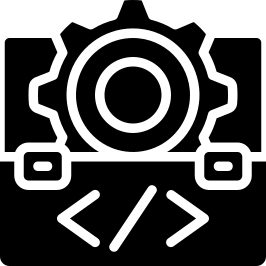

---

#### Is it this ?

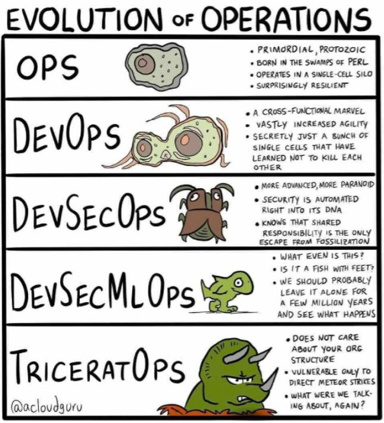

---

# DevOps is not

* Devs doing Ops job
* Ops doing Devs job
* A job title (at least it shouldn't)

---

# Okay, so what is DevOps ?

**DevOps is neither a profession nor a framework**. It is an approach that has become a philosophy that aims to **break down the silo between the teams in charge of application development, known as Dev, and those in charge of infrastructure, known as Ops**. Hence the name DevOps.

This principle was later extended to the teams in charge of security, the Sec. Hence the name **DevSecOps**.

---

# Sources and Worklabs

* https://github.com/mathieu-junia/cours

---

# DevOps Principles

As a reminder, the DevOps movement grew out of a series of conferences, including DevOpsDays, which began in 2008.

They concluded that the compartmentalisation of development (Dev) and operations (Ops) teams was **counter-productive**. What's more, their working methods clashed. **One was agile** and **the other still used the V cycle**.

---

# CALMS

It was in 2010/2016 that the founding principles of DevOps with the acronym CALMS was made.
* **C**ulture,
* **A**utomation,
* **L**ean,
* **M**easures,
* **S**hare.

---
#### Culture

If you don't have this Culture, all attempts to adopt it will be in vain. **Without the support of senior management, any project is doomed to failure**. DevOps calls for closer collaboration between two teams, Dev and Ops. It can't be done without this support.

#### Automation

**Automation involves freeing teams from repetitive tasks that have no real added value.** It's also about giving people the means to focus on those tasks that really add value.

---

#### Measure

**If you can't measure, you can't improve.** You can't just measure the time taken to deploy software. Other indicators need to be put in place so that the process can be continuously improved.

#### Sharing

**Sharing expresses the need for ongoing communication between the development and operational teams. The aim is to create a shared contribution.** People are prepared to work together if their thoughts and opinions are heard. So they share their ideas, analyses, data and results.

---

#### Lean

Lean is a production management method that focuses on "chasing waste". **This principle of rationalisation seeks to reduce excesses, by limiting to a minimum the number and duration of meetings, the size of teams and the number of tools likely to deliver the expected results.**

---

##### Anti Types & Types  of DevOps Team Topologies

**So what team structure is right for DevOps to flourish?** Clearly, there is no magic conformation or team topology which will suit every organisation.

By exploring the strengths and weaknesses of these team structures (or "topologies"), we can identify the team structure which might work best for DevOps practices in our own organisations, **taking into account Conway’s Law** (the architecture of the software reflects the architecture of the company.)

---

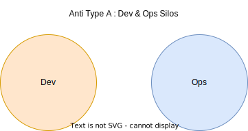

* "Throw it over the wall" is a common problem between Dev and Ops.
* Devs and Ops lack context and communication, causing problems.
* This topology is bad, but there may be worse topologies.

---

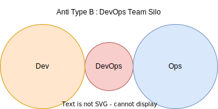

* The DevOps Team Silo is created by managers or executives who want to implement DevOps.
* The DevOps team becomes another silo, creating further distance between Dev and Ops.
* A separate DevOps team only makes sense only **if it is temporary and has a clear mandate to bring Dev and Ops closer together**.

---

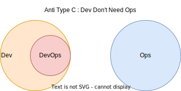

* The Anti-Type C DevOps Topology is created by developers and
development managers who underestimate the importance of operational skills and activities.
* They assume that Ops is no longer necessary due to the Cloud.
* **Recognizing the importance of Operations as a discipline can help avoid mistakes and pain.**

---

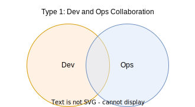

* Type 1 DevOps Topology is the ideal collaboration between Dev and Ops teams.
* **Each team specializes where needed, but also shares where needed.**
* Establishing this model requires substantial organizational change and strong technical leadership.
* **The potential effectiveness is high.**

---

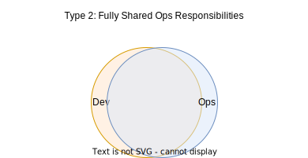

* Type 2 DevOps Topology is where ops people are integrated into product development teams.
* There is little separation between Dev and Ops.
* **This topology is usually achieved by organizations with a single web-based product**, but may not be applicable to organizations with multiple product streams.
* **The potential effectiveness is high.**

---

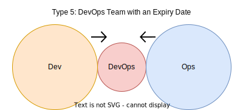

* Temporary team with a mission to bring Dev and Ops closer together.
* The team translates between Dev and Ops, introducing new ideas and thinking about details.
* **The goal is to eventually make itself obsolete.**
* Long-term responsibility for deployments and production diagnostics should not be given to the temporary team to avoid becoming an Anti-Type B.

---

#### What will I do as a devops engineer ?

* Writing YAML files, a looot (a s**t ton) of YAML files. YAML is the defacto configuration file standard for nearly every software (from CICD pipelines, to k8s, docker compose, traefik, etc.).
* Write, test, and secure Docker images.
* Write REST APIs, CLIs.
* Add observalibility to deployed solutions.
* Writing, maintaining templates: projects, REST APIs, tf modules.
* Manage k8s clusters (**this is a full time job**).
* Deploy infrastructure with IaC tools: Terraform, OpenTofu, Pulumi, Bicep, etc.

---

#### DevOps Ecosystem

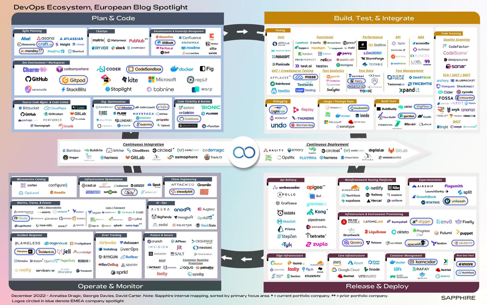

---

## So what ?

There are two many softwares, frameworks, trends to be able to know all of them.

What we need to do is to **focus on principles, not the tools**. While some of them are now industry standard, many more are not and the tools you're allowed to use will depend on the company you're in.

Moreover, what was standard 10 years ago can be outdated today and considered "legacy". But can still be useful to know.

VM -> Containers -> k8s -> KubeVirt (VMs on k8s).

---

## What are these principles ?

* Test
* Commit
* Repeat

This has to be done in a systemic way, so we automate all of this. To automate this in the best way possible, we rely on:

* Continuous Integration
* Continuous Delivery
* Trunk-based Development

---

#### TL;DR

**Manage CICD**: Everything listed above is related to CICD : **C**ontinuous **I**ntegration **C**ontinuous **D**elivery.

**Continuous integration**: Developers practicing continuous integration merge their changes back to the main branch as often as possible. **The developer's changes are validated by creating a build and running automated tests against the build.**

---

**Continuous Delivery emerged in the early 2000s**, building on the techniques of Continuous Integration, and was popularised by the book "*Continuous Delivery: Reliable Software Releases Through Build, Test, and Deployment Automation*".

The term is taken from the first principle of the Agile Manifesto (2001), which states:

**Our highest priority is to satisfy the customer through early and continuous delivery of valuable software.**

Continuous delivery is an extension of continuous integration since **it automatically deploys all code changes to a testing and/or production environment after the build stage**.

---

**Continuous deployment**: Continuous deployment goes one step further than continuous delivery. With this practice, every change that passes all stages of your production pipeline is released to your customers. **There's no human intervention, and only a failed test will prevent a new change to be deployed to production.**

From now on, we will be mainly focused on **C**ontinuous **I**ntegration **C**ontinuous **D**elivery.

Theory, alhtough sometimes necessary, is boring. To understand this, we will build a project and add more CICD bricks each time.

---

## Goal

What do we want to deploy ?

We will deploy an LLM application in a micro-service way:
* one container will host the frontend (done with streamlit).
* one container will host a REST API (done with FastAPI) that will communicate with the LLM endpoint.
* Both part will be tested, the containers will be tested, we will generate artifacts (tests reports, images, SBOMs).
* Deployment will be made via CICD pipeline.

---

## Step 1

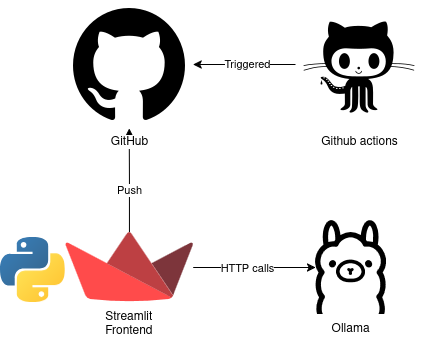

---

## Step 2

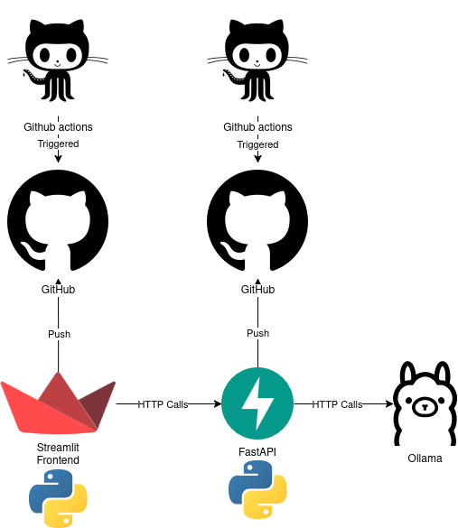

---

## Step 3

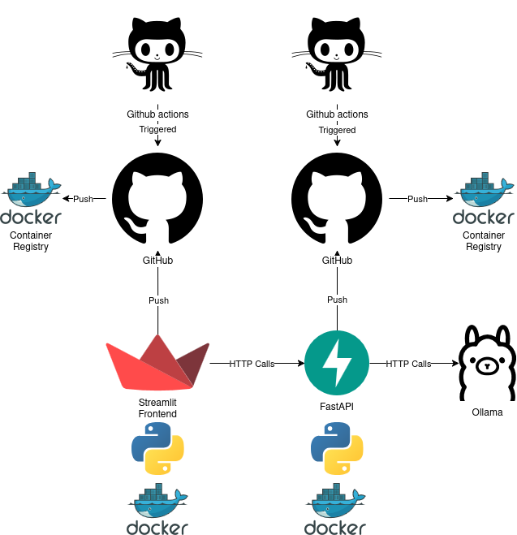

---

## Step 4

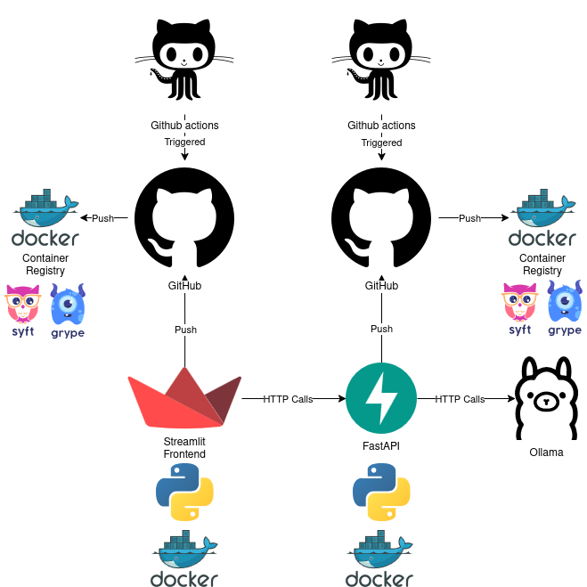

---

### How to deploy: build a Deployment Pipeline

To deploy, we need a deployment pipeline.

The deployment pipeline encompass both the CI part and th CD part.

**This is the only possible access to production.**

---

We do not start to build a Deployment Pipeline by working out a complex plan to build all the steps, tests and processes necessary for some future vision of the complete system. **We follow the principles of Continuous Delivery: working iteratively, in small steps**.

A Deployment Pipeline has four essentials components/tasks:
1. Commit Stage
2. Artifact Repository
3. Acceptance Stage, and
4. Ability to Deploy into Production

---

## Continuous integration : Trunk Based Development

[Trunk-Based Development](https://trunkbaseddevelopment.com/) (TBD) is a software development strategy where developers primarily work directly on the main branch of their code repository (often called "trunk" or "main").

* Frequent, small changes are merged into the main branch.
* Developers avoid long-lived feature branches.

---

## Principles of the Continuous Deployment

### Work in Small Batches

Reduce Batch Size:
* Smaller batches are easier to verify and fail faster.
* Less prone to sunk cost fallacy.
* Amplify feedback loops.

How Small? As small as possible to get production feedback.
Benefits: Exposes and removes hidden waste in upstream processes.

---

### Deploy More Often

**Common Mistake:** Deploying only completed features.

Benefits:
* Reduces inventory waste.
* Rapid feedback on quality gates.
* Lowers production fix risks.

---

### Deploy More Often

Addressing Objections:

* "Incomplete features deliver no value": Other stakeholders (product team) benefit.
* "Customers don't want frequent changes": Primarily for production support (incidents, vulnerabilities).

---

### Commit Smaller Changes

* Keep branches short-lived (less than a day).
* Frequent integration into trunk/master.
* Immediate fix for build failures.

Benefits:
* Improves testing, evolutionary coding, trunk-based development.
* Better work decomposition and teamwork.
* Uncovers upstream issues.

---

### Refine Smaller Stories

**Typical Scrum:** 5-10 day stories, often take 10-15 days to deliver.
Suggestion: Average story size should be close to one day.

Hyper-Sprints:
* 2.5-day sprints with refinement, work, delivery, and retrospective.
* Initial failure followed by improved skills and teamwork.
* Increased throughput (doubled in 6-8 weeks).

---

### Refine Smaller Stories

Uncovers Upstream Impediments:
* Missing product information.
* External dependencies.
* Change Advisory Board issues.
